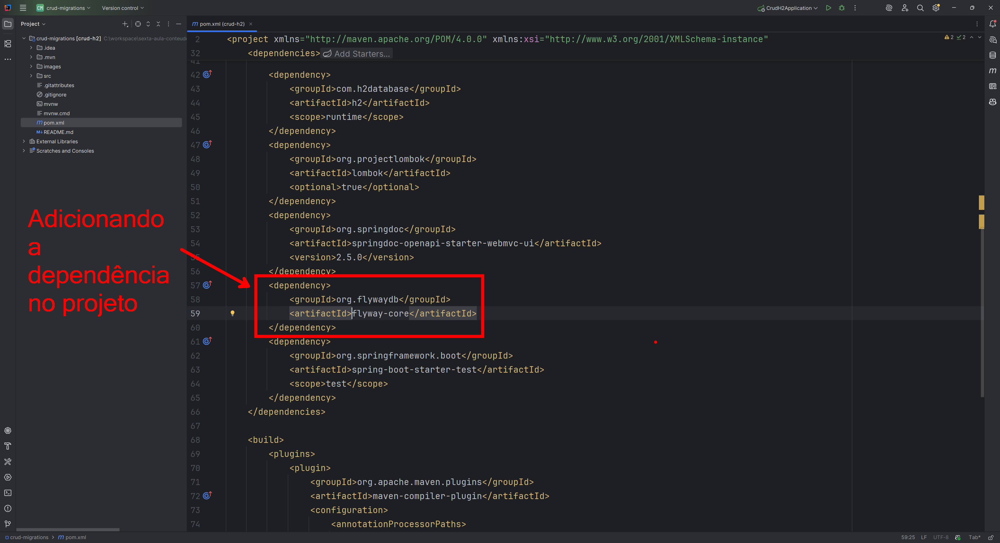
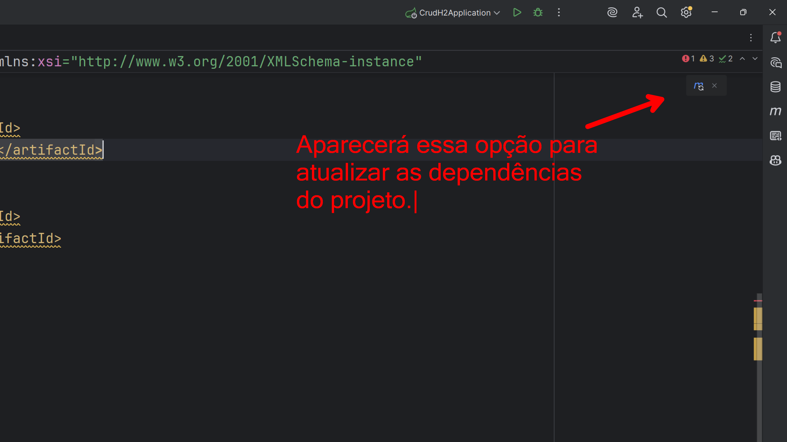
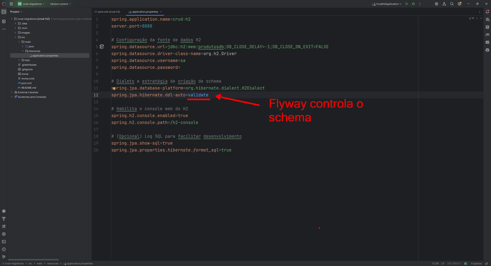
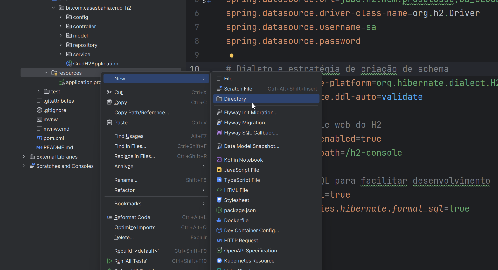
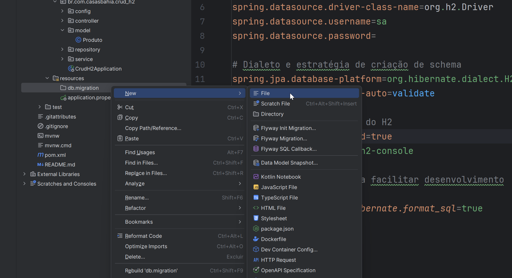
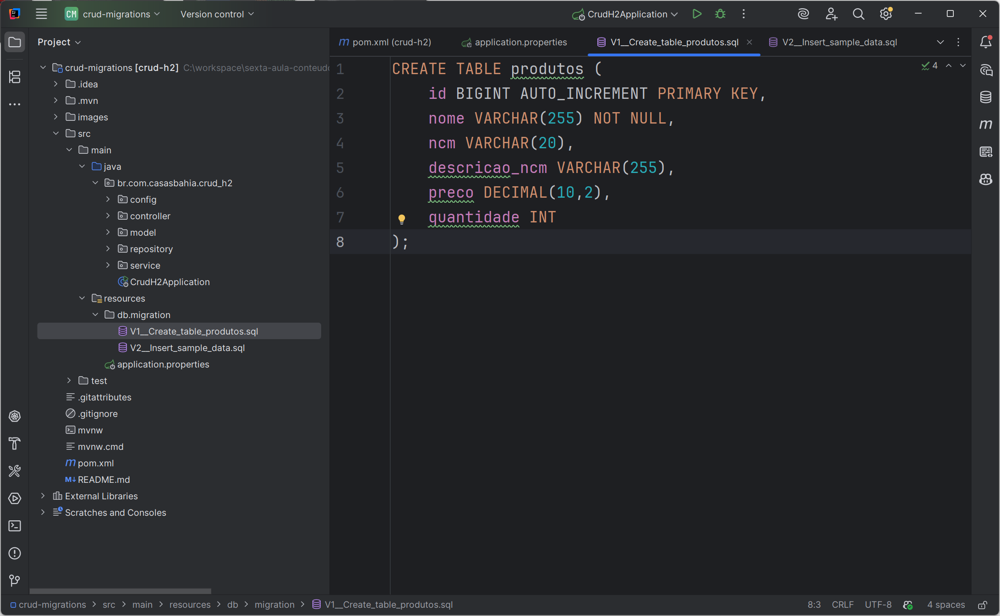
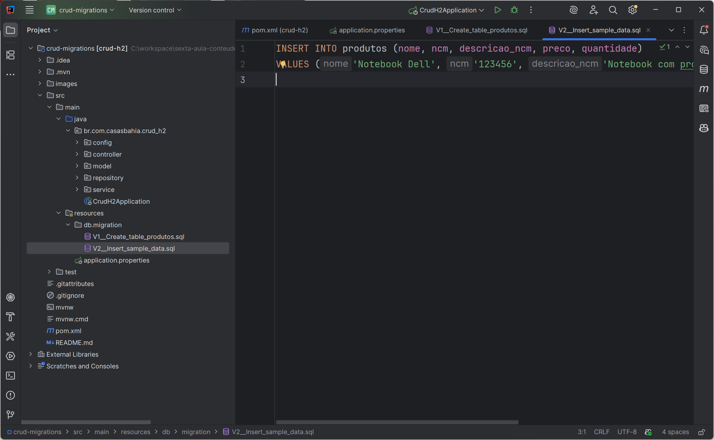
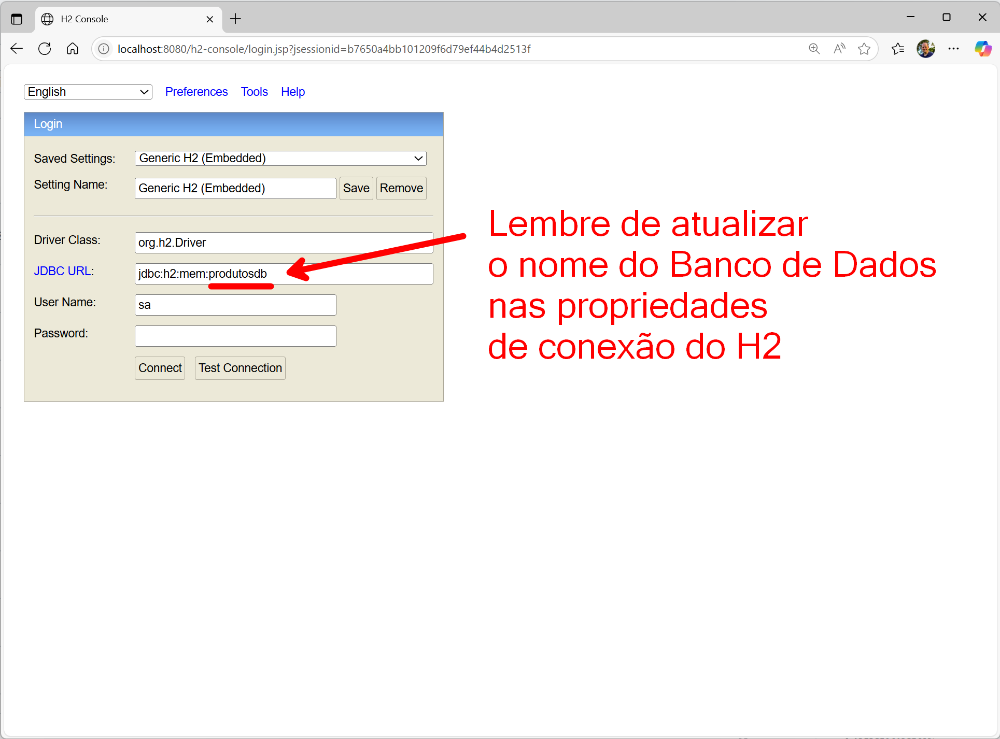
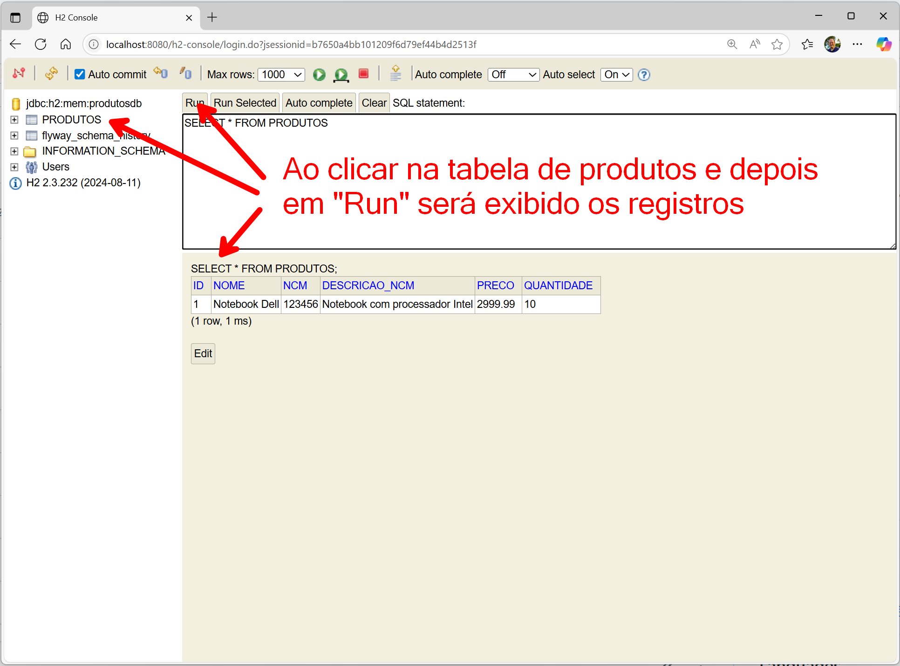
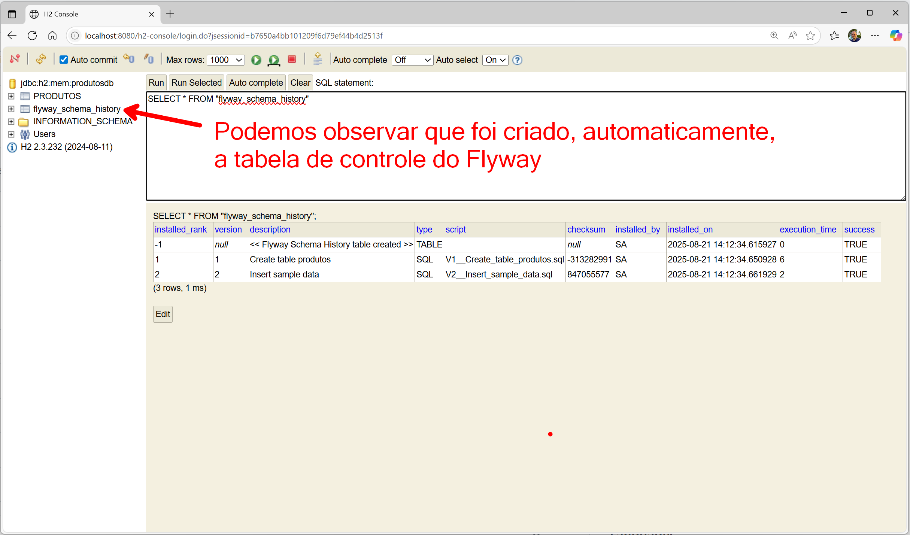

# 📚 Migrations em Microserviços Java

## 🎯 Objetivo da Aula

Nesta aula, vamos aprender como aplicar **migrations** em **microserviços Java com Spring Boot**, utilizando o banco de dados **H2**.
O objetivo é garantir que o **schema do banco** seja versionado e atualizado de forma automática, segura e reproduzível em diferentes ambientes. 🚀

---

## ⚙️ Pré-requisitos 🧑‍💻

* ☕ JDK **21**
* 🍃 Spring Boot **3.x.x**
* 🐦 Flyway **10.x**
* 🗄️ Banco **H2** (memória ou arquivo)


📌 **Recomendação**: utilize como ponto de partida o projeto já implementado na Aula 1 (CRUD com Spring Boot e H2) ou o projeto da Aula 3 (Documentação com Swagger/OpenAPI).
Assim, você já terá a base configurada com entidades, repositórios e controladores, facilitando a inclusão do Flyway para controlar as migrations. 🚀

---

## 🧩 O que são Migrations? 📜

**Migrations** são scripts versionados que descrevem mudanças na estrutura do banco de dados.
Elas permitem que o banco evolua junto com a aplicação sem perda de consistência.

### ✅ Benefícios

* 🕒 Histórico versionado do schema.
* ♻️ Facilidade de rollback em caso de erro.
* 🌍 Reprodutibilidade entre ambientes (dev, homolog, produção).
* 🤖 Automatização no pipeline CI/CD.

---

## 🛠️ Ferramentas de Migrations no Java 🔧

As ferramentas mais usadas no ecossistema Spring Boot são:

* 🐦 **Flyway** → simples, baseada em scripts SQL.
* 📜 **Liquibase** → mais robusta, suporta XML, YAML, JSON e SQL.
* 🍃 **Mongock** → focada em bancos NoSQL (MongoDB).

👉 Nesta aula, usaremos **Flyway** com **H2**.

---

## 🔎 Estudo de Caso: CRUD de Produtos (Spring Boot + H2) 🛍️

- Na **Aula 1** já criamos um CRUD de produtos com Spring Boot e banco H2.
- Na **Aula 3**, implementamos a documentação da API com Swagger/OpenAPI. 
- Agora, vamos evoluir este projeto adicionando **migrations com Flyway**.

Dessa forma vamos garantir que o banco de dados também esteja versionado e atualizado automaticamente.

---

## ⚙️ Configuração do Flyway ⚡

### 1️⃣ 📦 Adicionar dependência no `pom.xml`

```xml
<dependency>
    <groupId>org.flywaydb</groupId>
    <artifactId>flyway-core</artifactId>
</dependency>
```

- Segue as imagens desse processo sendo realizado em nosso projeto:

  

  


---

### 2️⃣ ⚙️ Ajustar `application.properties`

```properties
spring.application.name=crud-h2
server.port=8080

# Configuração do H2 (memória)
spring.datasource.url=jdbc:h2:mem:produtosdb;DB_CLOSE_DELAY=-1;DB_CLOSE_ON_EXIT=FALSE
spring.datasource.driver-class-name=org.h2.Driver
spring.datasource.username=sa
spring.datasource.password=

spring.jpa.database-platform=org.hibernate.dialect.H2Dialect
spring.jpa.hibernate.ddl-auto=validate   # Flyway controla o schema

# Console H2
spring.h2.console.enabled=true
spring.h2.console.path=/h2-console
```

- Segue a imagem desse processo sendo realizado em nosso projeto:

  


> 💡 **Persistência em arquivo (opcional):**
>
> ```properties
> spring.datasource.url=jdbc:h2:file:./data/produtosdb;AUTO_SERVER=TRUE
> ```
>
> Use arquivo se quiser que os dados permaneçam entre execuções.

#### Propriedades recomendadas do Flyway (boas práticas) 🛡️

```properties
spring.flyway.enabled=true
spring.flyway.validate-on-migrate=true
spring.flyway.clean-disabled=true
spring.flyway.out-of-order=false
spring.flyway.group=true
spring.flyway.locations=classpath:db/migration
```

* **spring.flyway.validate-on-migrate**: valida o schema antes de aplicar migrações.
* **spring.flyway.clean-disabled**: desabilita o comando 'clean' para evitar perda de dados.
* **spring.flyway.out-of-order**: permite migrações fora de ordem (não recomendado).
* **spring.flyway.group**: executa migrações em grupo (transação única).
* **spring.flyway.locations**: define os locais dos scripts de migração.

---

### 3️⃣ 📝 Criar scripts de migrations

Os scripts ficam em:

```
src/main/resources/db/migration/
```

- Segue as imagens desse processo sendo realizado em nosso projeto:

  

  


#### Exemplo: `V1__create_table_produtos.sql`

```sql
CREATE TABLE produtos (
    id BIGINT AUTO_INCREMENT PRIMARY KEY,
    nome VARCHAR(255) NOT NULL,
    ncm VARCHAR(20),
    descricao_ncm VARCHAR(255),
    preco DECIMAL(10,2),
    quantidade INT
);
```

- Segue a imagem desse processo sendo realizado em nosso projeto:

  


#### Exemplo: `V2__insert_sample_data.sql`

```sql
INSERT INTO produtos (nome, ncm, descricao_ncm, preco, quantidade)
VALUES ('Notebook Dell', '123456', 'Notebook com processador Intel', 2999.99, 10);
```

- Segue a imagem desse processo sendo realizado em nosso projeto:

  


```sql
INSERT INTO produtos (nome, ncm, descricao_ncm, preco, quantidade)
VALUES ('Notebook Dell', '123456', 'Notebook com processador Intel', 2999.99, 10);
```

- Segue a imagem desse processo sendo realizado em nosso projeto:

  


---

## ▶️ Execução 🎬

1. ▶️ Rodar a aplicação no IntelliJ ou VS Code.
2. 🔍 O Flyway detecta e executa os scripts automaticamente.
3. ✅ Verificar no **console H2** (`http://localhost:8080/h2-console`) que as tabelas e dados foram criados.

📷 **Imagem dos Logs de Execução**
- Segue abaixo a imagem com os **logs do microserviço em execução**, evidenciando que as **migrations foram aplicadas com sucesso** pelo Flyway.

  

- Ao acessar o H2 Console, você verá as tabelas e dados criados.

  

  

---

## 📐 Convenção de Nomenclatura de Migrations 🗂️

O Flyway segue um padrão de nomenclatura para organizar e aplicar os scripts:

* `V1__create_table_produtos.sql` → criação da tabela de produtos.
* `V2__insert_sample_data.sql` → inserção de dados de exemplo.
* `V3__add_column_categoria.sql` → alterações incrementais.

### Regras Importantes

* 🔢 O prefixo **V** indica uma versão.
* ➕ O número após o `V` é **incremental**.
* ⬜ Use **dois underscores (`__`)** para separar a versão da descrição.
* 🖊️ A parte descritiva deve ser uma **descrição clara** do que o script faz; recomende **snake\_case** e idioma consistente.

> 🔎 Seus logs/tabela de histórico refletirão exatamente os nomes usados nos arquivos. Mantenha a padronização no repositório.

---


## 🧱 Evoluções úteis (integridade e performance) ⚡

#### `V4__add_constraints_and_indexes.sql`

```sql
ALTER TABLE produtos
  ADD CONSTRAINT uk_produtos_ncm UNIQUE (ncm);

CREATE INDEX idx_produtos_nome ON produtos (nome);
```

#### `V5__add_categoria_and_backfill.sql`

```sql
ALTER TABLE produtos ADD COLUMN categoria VARCHAR(60);

UPDATE produtos
SET categoria = 'INFORMATICA'
WHERE ncm = '123456';
```

---

## 🔄 Migrations de Rollback ⏪

O **Flyway**, em suas versões atuais, **não executa automaticamente scripts de rollback (Undo Migrations)**.
A recomendação oficial é sempre criar **um novo script de migration (`Vx`)** que reverta a alteração anterior, em vez de tentar desfazer diretamente um script existente.

### Exemplo

Se você criou a migration:

```
V2__insert_sample_data.sql
```

E deseja remover os registros inseridos, crie uma nova migration:

```
V3__remove_sample_data.sql
```

Conteúdo do script:

```sql
DELETE FROM produtos WHERE nome = 'Notebook Dell' AND ncm = '123456';
```

> ⚠️ **Não edite migrations já aplicadas.** Isso causa *checksum mismatch*. Em dev, `flyway repair` pode ajustar o histórico; em produção, **crie uma nova `Vx`** para corrigir o estado.

---

## 📊 Tabela de Controle do Flyway 📋

Ao executar as migrations, o Flyway cria automaticamente uma tabela de controle chamada **`flyway_schema_history`**.
Essa tabela registra o histórico de todas as migrations aplicadas no banco de dados.

### Estrutura típica

- Segue o exemplo de registros gerados no estudo de caso na tabela `flyway_schema_history` em nosso Banco de Dados:
  

Podemos observar os campos:
* 🔢 **installed\_rank** → ordem de execução da migration.
* 🔖 **version** → versão definida no nome do script.
* 📝 **description** → descrição da migration.
* 📂 **type** → tipo (SQL, Java, etc.).
* 📜 **script** → nome do arquivo executado.
* 🔐 **checksum** → hash de verificação do script.
* 👤 **installed\_by** → usuário responsável pela execução.
* ⏰ **installed\_on** → data e hora da execução.
* ⏱️ **execution\_time** → tempo de execução em ms.
* ✅ **success** → indica se a execução foi bem-sucedida.


Essa tabela é fundamental para que o Flyway saiba quais migrations já foram executadas e quais ainda precisam ser aplicadas.

---

## 🆘 Troubleshooting (rápido) 🛑

* ⚠️ **Table already exists** → mantenha `ddl-auto=validate` e ajuste a sequência de migrations.
* 🛠️ **Checksum mismatch** → não reescreva scripts aplicados, sempre crie uma nova `Vx`.
* 🔀 **Ordem fora de sincronia** → renumerar em branch; evite `outOfOrder=true` em times grandes.
* 📂 **Dados somem no restart** → H2 em memória; use URL de **arquivo** se quiser persistência local.

---

## 🚀 Boas Práticas 🌟

* 📌 Sempre criar uma nova versão de migration ao invés de alterar uma existente.
* 🖊️ Nomear scripts de forma clara (ex.: `V3__add_column_categoria.sql`).
* 🔒 Usar `ddl-auto=validate` para garantir que o schema esteja em conformidade com as migrations.
* 🤖 Integrar Flyway no **pipeline CI/CD** para garantir consistência em todos os ambientes.
* 🏗️ **Fronteira por serviço**: cada microserviço possui **seu schema e suas migrations**.
* ⏩ **Forward-only**: migrations são imutáveis e sempre avançam o histórico.

  * Recomenda-se a adoção da **estratégia de sempre avançar o histórico do banco**: você nunca edita, remove ou “desfaz” uma migration aplicada; qualquer correção é feita por outra migration de versão mais nova.

---

## 📌 Conclusão ✅

* 🐦 O **Flyway** facilita a evolução do banco de dados junto com o código.
* 🧩 Em microserviços, cada serviço deve **gerenciar suas próprias migrations** e manter histórico **forward-only**.
* 🗄️ Com Spring Boot + H2, temos um ambiente simples e ideal para **estudos e testes**.
